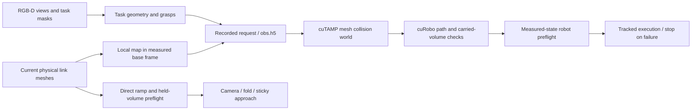

# Collision pipeline audit — 2026-09-22

The original room option did not make the pipeline collision-aware. Obstacles disappeared at several stages,
and some failed motions were retried after disabling carried-object collision geometry. This audit corrects
those paths and measures physical contacts in task 23, `boxing_books_up_for_storage`.

The full six-book task remains **0/6**. The corrected full run refused colliding shelf approaches and recorded
zero unintended contacts; a separately prepared book grasp completed collision-free box insertion. An ordinary
can pickup and recovery placement also executed successfully, while its bin-placement goal remained false.
These results separate the repaired collision paths from the remaining grasp/placement feasibility failures.

This is an **oracle manipulation benchmark**, using simulator geometry, sticky grasps, and base teleportation.
It does not implement an RGB-D mapping system or navigation policy. Avoid treating an isolated placement result
as success on the complete six-book task.

The subsequent [cross-task validation](CROSS_TASK_VALIDATION.md) ran three additional full tasks. It found
remaining synthetic-support and gripper-state modeling failures, plus one observed wrist/desk contact.
The collision fixes should not be treated as a general collision-free execution guarantee.

## Data and motion paths



Key code is in `scene.py` (physical map), `r1pro.py` and `collision.py` (bridge preflight),
`tiptop/b1k/bridge/protocol.py` (record/replay), `tiptop/b1k/bridge/executor.py` (execution),
`tiptop/tiptop/tiptop_websocket_server.py` (world assembly), and cuTAMP install patches 12–14.
The `tiptop/...` paths are relative to the repository root and live in the submodule.

## What was wrong

| Stage | Failure | Correction |
|---|---|---|
| Scene selection | Dropped task containers, supports, small objects, merged walls, near-base geometry, and obstacles intersecting the start; capped the set | Keep all physical objects within the local reach region, including task objects; reject invalid starts without deleting geometry |
| Geometry | Reused decimated viewer meshes and stale articulated poses | Preserve physical collision triangles and concavities; cache rigid-link geometry and refresh every link transform |
| Request | Several early capture returns skipped the map | Attach the measured start, locked-joint state, and complete local map after every capture path |
| Replay | `obs.h5` omitted room geometry and placement surfaces | Store meshes, poses, role metadata, locked joints, and placement surfaces; reconstruct the same request |
| Held-object handoff | Camera-occluded objects already in the gripper failed before their available physical geometry was used | Validate and retain explicit held-object geometry; preserve visibility requirements for unheld goals |
| Particle optimization | Removed `sim_*` meshes and converted remaining statics to solid bounding boxes | Use mesh collision costs, preserving container interiors and shelf openings |
| Task-object roles | Fixed bookcases could be picked; partial reconstructed book hulls distorted carried volume | Mark fixed furniture and replace movable geometry in its original grasp coordinate frame |
| Collision caches | Overflow dropped distant obstacles; empty worlds left old mesh slots enabled | Merge static meshes without losing triangles; reject irreducible overflow; clear enable flags in place |
| Carried objects | Sparse surface spheres missed book faces; failed plans retried with the object detached | Use a conservative volume cover; keep it attached throughout transport and fail if no checked motion exists |
| Motion solver | Could return partial plans after failed retreat/home; 250 ms often expired before graph fallback | Reject incomplete candidate plans; enable earlier graph fallback and trajectory finetuning |
| Solver state | An upstream world-collision rejection left self-collision checking disabled for the next query | Restore both collision constraints on every return and exception, preserving their prior settings |
| Execution | Accelerated slow plans, skipped checked corners during resampling, moved unchecked to `q_init`, and released after tracking failure | Preserve path vertices and planned speed limits, reject discontinuous starts, stop before subsequent gripper events, and cancel the residual push command |
| Bridge motions | Camera, fold, and sticky-grasp ramps bypassed motion planning and ignored containing furniture | Preflight the full robot and carried volume against current physical meshes before the first motor command |
| Relocation | A blocked fold still teleported an extended arm into furniture | Validate the full measured destination posture and live carried volume before teleportation; try another stance on collision |
| Carried self collision | Direct folding checked the room but could fold a held can into the robot base | Check carried volume against robot links and other held objects throughout direct motions, preserving configured grasp contacts |
| Sticky contact targeting | Combined base-frame directions with world-frame extents; a projected box radius missed the physical surface | Raycast the physical front surface and transform contact and jaw directions consistently |
| Legacy proximity | Large/elongated triangles exhausted the subdivision helper during stance selection | Use exact cached triangle BVH queries, with conservative failure handling |

Physical map entries carry `fixed_base`; tracked task objects also carry `task_label`. A movable gets one
collision representation that can travel with the robot; a target container retains its physical walls. Matching perceived surface meshes and container floor proxies are used for
placement sampling without filling the cavity with a duplicate solid collider. The RANSAC support plane remains
because the planner's room map omits physical floors to accommodate wheel contact.

The CPU guard uses the same robot collision-sphere configuration as the planner, with full-joint forward
kinematics including the torso, opposite arm, cameras and fingers. Bounded sphere travel determines path samples,
with interval inflation covering between samples. The final refinement bounds sphere-centre travel to 5 mm
per interval; geometry and radii remain unchanged. Exact triangle BVH distances preserve narrow openings.
Measured map-check time on the placement fixture fell from 4.73 s to 0.019 s after replacing a mesh-subdivision
helper with exact cached BVH queries.

Before each planner trajectory and gripper event, execution also checks the measured full robot against the
current physical scene. It preserves every polyline edge and covers finger motion independently of arm timing,
closing the planner's always-open-finger approximation. A rejected capture ramp also returns without
sending a settling hold that could repeat its rejected finger command. If a direct ramp instead aborts during
execution because tracking fails, it sends at least one measured-position hold to cancel the residual target,
even when zero settling steps were requested; it preserves the gripper command. Floor geometry enters the CPU guard with only the base
and wheels exempted. The redundant planned-motion check covers the robot; cuRobo retains responsibility for the
attached object's swept collision geometry.

Planner target-contact exceptions are narrow: active fingers may touch the just-released object during straight
retreat and the button during press/retreat. A dense check still tests all other robot and attached geometry
against that target at zero contact margin. Other obstacles retain their normal collision checks.

## Running the corrected checkout

The simulator and planner use separate Python environments. This host's simulator environment has an editable
`b1k` install pointing at a neighboring checkout, so invoking Python without an explicit import path can silently
run old code. The launcher sets both local package paths and logs the imported executor source.

No environment installation or rebuild is needed. On this host the existing simulator interpreter is
`b1k/bin/python`; the planner uses `tiptop/.pixi/envs/default/bin/python`. Set `SIM_PYTHON` to override the simulator
interpreter. With the existing M2T2 service available at port 8123, start an isolated planner in one terminal:

```bash
TIPTOP_GPU=2 TIPTOP_PORT=8872 TIPTOP_CONFIG=tiptop/config/tiptop_sim_r1pro.yml \
  TIPTOP_PARTICLES=256 TIPTOP_MAX_PLANNING_TIME=40 TIPTOP_RERUN_MODE=disabled \
  MKL_NUM_THREADS=1 OMP_NUM_THREADS=4 \
  OmniGibson/omnigibson/tiptop/scripts/start_tiptop_server.sh --seed 2300
```

Then run the simulator from the repository root in another terminal:

```bash
CUDA_VISIBLE_DEVICES=2 OMP_NUM_THREADS=8 \
  OmniGibson/omnigibson/tiptop/scripts/run_bench.sh \
  --task-name boxing_books_up_for_storage --instances 0 \
  --knowledge oracle --grasping-mode sticky --torso 1.2 -1.7 -0.9 0.0 \
  --views head left_wrist right_wrist --host localhost --port 8872 \
  --out-dir runs/collision_audit/books
```

Physical room geometry and compartment-floor placement are enabled by default for R1Pro. `--no-room` and
`--no-inside-region` are explicit ablations. Meshes are saved in the observation's `room` HDF5 group and placed in
the measured base frame on each request. Empty maps are recorded explicitly, and replay preserves object order.

Planner changes include tracked install patches, not only edits to the ignored runtime clone. The complete
14-patch cuTAMP series applies to pristine cuTAMP v0.0.6 and reproduces the installed Python source. Patches 08/09
previously duplicated earlier hunks and prevented a clean installation; those duplicates are corrected.
The separate `curobo-01-restore-collision-check-state.patch` reproduces the tested upstream Python fix at
cuRobo `b5fad1d`; the installation hook applies it idempotently. The existing environment was patched directly
without installation or a CUDA rebuild. A real GPU regression verifies world rejection followed by correct
self-collision rejection.

## Experiments and evidence

Artifacts are under `runs/collision_audit/`. Each simulator run freezes its imported bridge, planner and cuTAMP
source and records hashes, arguments, raw requests, contact records, simulator logs and videos. Baseline and
corrected task runs use public instance 301 (CLI index 0), planner seed 2300 and GPUs 1–3. Shared services and
other users' GPUs were left alone.

Contacts come from the simulator's rigid-contact data, not from joint lag. Task-23 summaries classify
book-to-gripper contact separately from surrounding furniture/container contact and retain all raw pairs.
Carried-book contacts are measured while attached; touching the box after release is expected placement physics.

### Controlled placement

The probe bypasses shelf extraction: it stands at the normal box stance, places one book in the hand, and
establishes an assisted fixed grasp. Those setup privileges are recorded in `probe_setup.json`. Evaluation then
runs the ordinary `inside(book_1, box_1)` request, including approach, insertion, release and retreat.

| Frozen run | Result | Execution steps | Unintended robot contacts | Carried-book external contacts |
|---|---|---:|---:|---:|
| `held_book_20260922` | Actual `Inside(book_1, box_1)` true | 375 | 0 | 0 |
| `held_book_final_20260922` | Actual `Inside(book_1, box_1)` true | 372 | 0 | 0 |
| `held_book_validated_20260922` | Actual `Inside(book_1, box_1)` true | 364 | 0 | 0 |
| `held_book_execution_guard_20260922` (execution-preflight checkpoint) | Actual `Inside(book_1, box_1)` true | 371 | 0 | 0 |
| `held_book_final_joint_20260922` (final shared checkpoint) | Actual `Inside(book_1, box_1)` true | 373 | 0 | 0 |

These are successive frozen revisions, not independent full-task seeds. They establish feasible
collision-aware insertion into the original target container. One satisfied book is 1/6 of the complete task;
the probe is not a benchmark score. The execution-preflight checkpoint completed all five trajectories, the guarded release, and
return motion, with maximum tracking error 0.00876 rad. It recorded 723 intended grasp-contact steps and no
instrumentation errors. The 1,145 total episode steps include 268 setup and 506 capture steps.

Video: `runs/collision_audit/held_book_execution_guard_20260922/episode/videos/boxing_books_up_for_storage_301_0.mp4`.
Result: `runs/collision_audit/held_book_execution_guard_20260922/probe_result.json`.

The final shared checkpoint also succeeds: five trajectories, 328 waypoints, 373 execution steps, maximum
tracking error 0.00860 rad, and 1,147 total steps (268 setup + 506 capture + 373 execution). Expanded contact
logging records **zero unintended upper-body/environment, carried-object/environment, or carried-object/non-grasping
robot contacts**, with 724 intended grasp-only records and no observer errors. This remains a prepared-grasp
placement probe, not an end-to-end task result.
Video: `runs/collision_audit/held_book_final_joint_20260922/episode/videos/boxing_books_up_for_storage_301_0.mp4`.
Result: `runs/collision_audit/held_book_final_joint_20260922/probe_result.json`.

### Obstacle routing

`eval_logs/collision_routing_probe_20260922.json` records a synthetic, unladen R1Pro motion query with a thin shelf
mesh blocking the direct joint interpolation. The direct path collided at 20/81 samples. MotionGen found an 81-waypoint detour;
an independent mesh collision query at 400 finer samples found zero penetration cost and feasible self/world
checks at those samples. This is sampled validation, not a continuous clearance certificate. The fixture,
start/goal, full trajectory and measurements are saved for reproduction.

### Full task

The baseline (`baseline_20260922`) finished normally after 2,712 s (45.2 minutes), 15,498 simulator steps and
29 teleports, scoring **0/6**. It recorded **6,676 unintended robot-contact steps**, including **1,715 steps
contacting the target box**. Phase totals are 1,578 capture, 375 stance, 4,721 sticky fallback, and 2 planned
execution steps (floor contact). The fallback wrapper called those records `initialization`; log correlation
identifies their actual phase. Carried-object contact was not instrumented in this baseline and is unknown.

One book temporarily satisfied `Inside`, then lost it before final scoring. Most contacts were during capture
and fallback grasps; it would be incorrect to attribute the 1,715 box-contact steps to a returned planner path.
Checking only cuRobo trajectories would miss these dominant failures.

The corrected full run (`fixed_final_20260922`) terminated normally after 922 s and 1,532 simulator steps:
**0/6 books, zero physical contacts, eight failed planned rounds, no executed planner trajectory.** It refused
unsafe shelf approaches. This snapshot includes complete mapping and ramp guards, but predates the final
measured-finger execution preflight and solver tuning; the guarded placement probe is separate evidence.

The latest full run (`books_sticky_surface_20260922`) includes the physical sticky-contact targeting,
measured-finger checks, exact proximity query and explicit `simulator_physical` map provenance. It finished
normally after 612.7 s and 1,532 steps: **0/6 books, zero unintended robot or carried-object contacts, eight
failed planned rounds, eight teleports, no accepted manipulation trajectory.** Correcting contact targeting
did not solve the collision-blocked shelf approaches.

The final shared-source full run (`books_final_joint_20260922`) includes the map and execution fixes, teleport
endpoints, carried-object/body checks, hidden-held geometry, and the cuRobo state fix. It predates only the final
5 mm sweep-subdivision refinement and zero-settle tracking-abort cancellation described below. It finished normally in 511.6 s:
**0/6 goals, 1,412 steps, eight teleports, eight failed planning rounds, no accepted manipulation trajectory.**
All three expanded unintended-contact metrics were zero (upper-body/environment, carried/environment,
carried/non-grasping robot), with zero raw contact rows or observer errors. This is safe refusal, not a solved
six-book task. The separately prepared 373-step placement demonstrates accepted motion at this checkpoint.

The final controlled, books and trash runs share `runs/collision_audit/final_joint_checkpoint_20260922`:
807 files were hash-verified, including the patched cuRobo Python source and five existing compiled extensions.
Runtime import logs and loaded libraries verify that these runs used the snapshot rather than the neighboring
editable checkout. No environment rebuild was performed.

The extraction diagnostic (`eval_logs/extraction_frame_probe_20260922.json`) checks all 104 proposed grasps for
book 6. Replacing its partial hull preserves world grasp transforms within 1.77e-9. Empty-world IK accepts
104/104 poses; full-room IK accepts 0/104, and every empty-world solution intersects bookcase 2. This identifies
colliding proposed grasps, not a coordinate-frame regression, and does not prove that no other grasp or stance
could work. Shelf extraction and the complete six-book task remain unsolved.

A separate sticky replay reconstructs four candidates at each of the first two saved stances. Both measured
starts are clear, but all eight returned Lula joint configurations intersect the physical bookcase. The least
blocked front-horizontal endpoints have 16.3 mm and 19.6 mm overlaps involving the gripper or wrist camera;
other endpoints have larger arm/camera overlaps. These checks concern the returned joint configurations,
not every possible IK solution for the same hand pose. The replay uses the logged hand convention rounded
to three decimals, a stated reconstruction uncertainty. Exact request transforms and reconstructed targets
are saved in `runs/collision_audit/books_sticky_surface_20260922/sticky_endpoint_diagnostic.json`, with the
reproduction script in `runs/collision_audit/sticky_endpoint_probe.py`.

Collision-aware IK also tested the intended hand poses at 3 cm and 5 cm precontact offsets, retaining the target
mesh: 0/16 solved across the two stances, versus 16/16 with an empty collision world. The achieved Lula hand
poses were within about 1e-5 m and 0.0016 rad of the requested poses, so its loose configured tolerance did not
explain those failures. A bounded 27-stance diagnostic then rigidly reexpressed the saved scene and the same
world hand poses for nearby bases (axis offsets of 0.2/0.4 m and yaw offsets of 20 degrees). Twelve starts
passed full robot constraints; all 96 goal queries at those starts failed with 32 IK seeds each. This is limited
sampling using the original local map crop, not proof of physical impossibility. The failed searches do not
justify removing furniture or accepting the colliding endpoints. Evidence is in
`eval_logs/sticky_collision_aware_ik_20260922.*` and `sticky_virtual_stances_20260922.*`.

### Follow-up from the secondary task

The first frozen `picking_up_trash` run (`trash_execution_guard_20260922`) acquired a can through its ordinary
sticky fallback, with no setup assistance beyond the benchmark's standard oracle/teleport conventions. It then
crashed during stance selection because the old proximity helper tried to subdivide a long triangle beyond its
iteration limit. This run is a failed regression, not a success: 0/3, 1,991 steps, 458 s, zero unintended robot
contacts and 14 attached-can/floor support-contact steps. The crash has a targeted physical-BVH fix and a
long-triangle regression test. The ordinary follow-up (`trash_fresh_final_20260922`) completed a planned
pickup and passed that held-can stance transition without crashing. Its subsequent placement request failed
before planning because the held can was invisible in all camera views, despite `in_hand` and its full current
physical mesh being present in the request. The diagnostic run was interrupted after reproducing two additional collision bypasses, with video finalized.
It has no final benchmark score or exact final step denominator. It recorded 103 unintended wrist-camera/trash-can
contact steps (13 during stance movement, 90 during holds) after a blocked fold followed by an unchecked teleport
destination. It also recorded 512 carried-can/floor support-contact steps: 17 during the planned can1 pickup and
495 while can2 remained on the floor after sticky closure. The planned can1 pickup completed 295 execution steps
across four trajectories with maximum tracking error 0.00301 rad and zero unintended upper-body contacts.
The first held can also touched the robot base after folding; the original upper-body/environment contact
metric did not capture carried-object/base contacts. Both bypasses now have guards and saved-state regressions. The can/base state is rejected at sample 0.
Replaying the first camera-contact joint state against the original bin map rejects the wrist camera at sample 0
with 1.6 mm sphere overlap. The post-contact map had already shifted the bin by about 2.6 mm, illustrating why
the earlier map matters. Replay script: `runs/collision_audit/teleport_guard_probe.py`; saved results:
`runs/collision_audit/trash_fresh_final_20260922/teleport_guard_replay.json` and
`teleport_first_contact_replay.json` in the same directory.
Its frozen source predates the later generic perceived-Mesh surface deduplication and rejected-capture-hold fix.

Read-only GPU replay checked the secondary task's failed approach. Full-map MotionGen IK accepted 270/274
approaches, and both fresh and warmed solvers found collision-free paths. Attachment removal propagated
through all internal models. Replaying an optimized satisfying particle preserved the actual approach
transform within 1.19e-7 and succeeded. These checks rule out the tested systematic transform and stale
attachment hypotheses; they do not explain the original 34 consecutive IK failures. The original run did
not record the actual attempted particles or solver RNG state. New failure diagnostics save up to 32 exact
failed pose queries per request in `tiptop_run.log`: start/goal, candidate parameters, relevant transforms,
request seed, and pre-query IK sampling RNG state. They do not capture the complete optimizer RNG or process
state, and do not change solver behavior. Scripts and measurements are in
`eval_logs/trash_particle_probe_20260922.*`, `trash_motion_probe_20260922.*`, and
`attachment_state_probe_20260922.*`.

The hidden-held-object fix now passes focused one-view and multi-view regressions: only explicit `in_hand`
labels with validated matching physical geometry may bypass visual reconstruction. No detections or masks
are fabricated; missing unheld objects still fail, and the 25 cm tool-distance check remains. Exact replay of
the failed request preserves all 56 can vertices within 2.1e-8 m, the grasp transform within 9.2e-9, all 240
attachment spheres within 7.3e-8 m, and all 33 static room meshes. It reaches motion refinement, which correctly
rejects the measured start: the carried can intersects the base. Robot-only self cost is zero; 29 attachment/base
sphere pairs overlap, with about 1.89 cm worst clearance violation before self-collision buffering. The simulator
log independently reports can/base contact after folding. This replay is evidence for the perception handoff
fix and a valid collision rejection, not a successful placement. Artifacts are in
`runs/collision_audit/trash_held_replay_20260922/`.

The sticky targeting diagnostic also confirmed actual errors: saved book contacts were 1.2–8.0 cm from the
physical front surface, while the maximum press/nudge range was only 2.9 cm. Synthetic rotated cases could put
the contact 13 cm inside an object. Physical raycasts and consistent coordinate transforms now replace that
calculation, with no relaxation of collision checks.

The final shared-checkpoint full trash run (`trash_final_joint_20260922`) was interrupted during repeated
stance search after floor-supported sticky grasps. It has no normal final score or exact final step denominator.
The finalized video decodes all 1,584 frames; raw contact records reach task step 3,168 (the periodic summary
at 2,820 is stale). It recorded 49 raw contact rows, zero unintended robot/environment contacts, zero
carried-object/non-grasping-robot contacts, and 27 carried-can/floor support-contact steps (15 for can2 and
12 for can1), with no observer errors. The simulator replaced the interruption handler, so these numbers
must not be presented as a complete benchmark result. Artifacts include `interruption.json` in that run.

### Conservative path-check refinement

The final shared-checkpoint trash run returned a pickup path that the bridge refused before movement. The
physical cabinet geometry agrees with the planner within 1.3e-7 m, and dense GPU checks find no penetration.
Exact CPU reconstruction identifies a conservative interval-padding overlap: 4.8826 mm actual sphere clearance
versus 4.9812 mm padding, a 0.099 mm refusal. Reducing the maximum sphere-travel interval from 10 mm to 5 mm
preserves the continuous bound and accepts that path without shrinking the robot or obstacles. On the saved
case, 317 samples took 0.595 s and refused; 609 samples took 0.988 s and passed; 1,479 samples at 2 mm took
5.022 s and passed. The production change uses 5 mm. Evidence:
`runs/collision_audit/trash_final_joint_20260922/cpu_sweep_resolution_diagnostic.json` and
`planner_path_collision_diagnostic.json` in that directory.

### Ordinary pickup, carry and recovery

The focused `can1_transfer_refined_20260922` run invokes the ordinary transfer strategy for can1 from the
original task scene. It has no prepared object, injected grasp or trajectory, and records those additional
setup privileges as an empty list. It retains the benchmark's standard oracle labels, simulator physical map,
and base teleports. This is one selected transfer, not a complete three-can benchmark.

It finished normally after 3,010 task steps and 370.0 s. The planned pickup completed four trajectories,
256 waypoints and 300 execution steps, with maximum tracking error 0.00350 rad. The held-object guard then
refused the fold into the robot base before movement. The measured destination posture passed its separate
check, and the robot reached the bin stance while retaining the can. Both inside-placement attempts failed
particle optimization. Normal recovery completed a planned placement on the floor and release: five
trajectories, 402 waypoints, 447 execution steps, maximum tracking error 0.00591 rad. The requested inside goal
remained **false**.

The complete run recorded **zero unintended robot/environment and carried-object/non-grasping-robot contacts**.
There was one carried-can/floor support-contact step during the recovery gripper opening/release (task step
2,790), 1,884 intended grasp-contact records, and no observer errors. The finalized video has 1,550 frames.
This verifies ordinary accepted motion and the held-can/base refusal; it does not establish successful bin
insertion. Results are in `focused_result.json` and `transfer_outcome.json`; video:
`runs/collision_audit/can1_transfer_refined_20260922/episode/videos/picking_up_trash_301_0.mp4`.

The run used `refined_guard_checkpoint_20260922`. The later zero-settle tracking-abort cancellation has two
focused regressions and the complete 311-test bridge suite; no tracking-abort branch occurred in this frozen
simulation. That source difference is recorded explicitly in `post_freeze_delta.json`.

## Checks and remaining limits

The current bridge suite passes **311 tests**. Planner validation passed
147 tests (excluding download-dependent H5 and visualization fixtures), including GPU mesh costs, hollow-container interiors, obstacle cache refresh, conservative book-volume
coverage, geometry-preserving cache overflow and failure propagation. The install patch chain was also checked
against pristine source. Whitespace and launcher syntax checks pass. Targeted Ruff checks have no new findings;
six unused imports in `r1pro.py` were verified to exist unchanged at HEAD and left alone.

```bash
OMNIGIBSON_HEADLESS=1 PYTHONPATH="$PWD/tiptop" \
  ./b1k/bin/python -m pytest OmniGibson/tests/test_tiptop_*.py -q

OMNIGIBSON_HEADLESS=1 CUDA_DEVICE_ORDER=PCI_BUS_ID CUDA_VISIBLE_DEVICES=2 \
  OMP_NUM_THREADS=4 MKL_NUM_THREADS=1 PYTHONPATH="$PWD/tiptop" \
  tiptop/.pixi/envs/default/bin/python -m pytest tiptop/tests \
  --ignore=tiptop/tests/test_tiptop_h5.py --ignore=tiptop/tests/test_visualization.py -q
```

- The physical map is privileged and local to a 2.5 m reach region. Perception-only mapping and base-path planning
  remain separate work. Teleport destinations are checked; a teleport is not a checked navigation path.
- Collision spheres approximate the robot. Conservative carried-object covers can reject valid tight placements
  or contacts with a supporting surface. Their enclosing boxes also fill a carried object's own cavities; static
  container cavities remain open. Rejecting a plan must not disable geometry to force it through.
- The planner checks robot self collision. The bridge also checks world collisions, carried-object/robot
  collisions, and collisions between carried objects. It preserves the model's per-arm grasp-contact exclusions.
  Robot-only self-collision checks for direct bridge ramps and teleport endpoints remain outside this CPU guard.
- Planner gripper events, gripper-only ramps and sticky closures receive swept-finger checks. Standalone
  release/hold calls in articulation helpers remain outside the planner callback.
- A displaced locked opposite arm is rejected instead of silently planned with the wrong fixed posture.
- Solver timeouts are iterative limits. The refinement budget is per satisfying skeleton, not a strict total
  request deadline; initialization/CUDA capture can exceed an individual query's nominal budget.
- Collision awareness does not solve grasp generation, difficult shelf extraction, or stance selection. Those
  limits must remain visible in the full-task score rather than being obscured by unsafe fallback motions.
